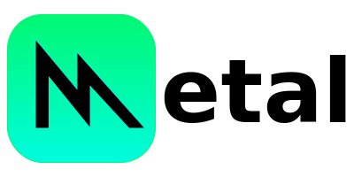
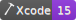
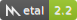

<p align="center">
   
</p>

<p align="center">
    <a href="https://swift.org/about/#swiftorg-and-open-source"></a>
    <a href="https://developer.apple.com/xcode/"></a>
    <a href="https://developer.apple.com/metal/"></a>
    <a href="http://doge.mit-license.org"></a>
</p>

This repo contains code with examples on how to use Apple's Metal GPU APIs. Some sample code has been created entirely by [me](https://github.com/dehesa), while others have been picked from Github. The latter ones are in this repo because they have been heavily modified, not only to support the latest version of Swift, but also to add support to iOS or macOS (when applicable). Links to the source Github repos or websites are provided.

## Projects

-   Command-Line apps.

    <div>
    <details><summary>GPU Inspector.</summary><p>

    Prints on `stdout` a brief description of all your available GPUs. For example:

    ```
    Apple M1 Max
      Built-in GPU
    Unified memory (shared with CPU)
      max recommended working set: 48 GB
    Feature set support
      family: apple 1, apple 2, apple 3, apple 4, apple 5, apple 6, apple 7, metal 3
    General Purpose Computing
      max threadgroup memory: 32 kB
      max threads per threadgroup: [1024, 1024, 1024]
      threads execution width: 32
    
    Intel(R) HD Graphics 530
      Built-in GPU (low power)
      Unified memory (shared with CPU)
        max recommended working set: 1.61 GB
      Feature set support
        family: common 1, common 2, common 3, apple 1, apple 2, apple 3, apple 4
      General Purpose Computing
        max threadgroup memory: 64 KB
        max threads per threadgroup: [1024, 1024, 1024]
        threads execution width: 32

    AMD Radeon Pro 460
      Built-in GPU
      Discrete memory
        max recommended working set: 4.29 GB
      Feature set support
        family: common 1, common 2, common 3, apple 1, apple 2, apple 3, apple 4
      General Purpose Computing
        max threadgroup memory: 64 KB
        max threads per threadgroup: [1024, 1024, 1024]
        threads execution width: 64
    ```

    </p></details>
    <details><summary>Gray converter.</summary><p>
    
    Transform an image into its gray-scale version.
    
    This command-line utitily expects a single argument indicating the location of the image to transform and outputs the gray scale version to the `~/Desktop` with name `out.png`.
    You can run it from Xcode by pressing ⌘ + R. This project scheme has an argument where you can specify a different image from the default image.

    This utility is based on [Safx](https://github.com/safx)' gray converter [compute sample](https://github.com/safx/Metal-CommandLine-Sample-Swift).

    </p></details>
    </div>

-   [Apple's sample code](https://developer.apple.com/metal/sample-code).

    <details><summary>Basic Tessellation.</summary><p>

    [This sample](https://developer.apple.com/library/content/samplecode/MetalBasicTessellation/Introduction/Intro.html) shows how to tessellate a triangle or quad patch with adjustable per-patch tessellation factors.

    </p><p align="center">
        
    </p></details>

-   [Metal by Example](https://metalbyexample.com).
    <br>[Warren Moore](https://warrenmoore.net) wrote this book in 2015. It was and it remains one of the best introductions to Metal I have found.
    I've migrated most chapters to the latest Swift and I've added support to macOS.

-   [**Shader Exam**](https://github.com/leon196/SIGExam).
    <br>[Leon Denise](https://twitter.com/leondenise) wrote a [tweet](https://twitter.com/leondenise/status/953716696161882114) with a typical shader exam he gives to his students on [SupInfo.com](https://rubika-edu.com).
    -   [Page 1](Shader%20Exam/Sources/Common/Assets/Exam/Page1.png) shaders:
        [pass](Shader%20Exam/Sources/Common/Pages/ShadersPage1.metal#L7),
        [mirror](Shader%20Exam/Sources/Common/Pages/ShadersPage1.metal#L17),
        [symmetry](Shader%20Exam/Sources/Common/Pages/ShadersPage1.metal#L24),
        [rotation](Shader%20Exam/Sources/Common/Pages/ShadersPage1.metal#L32),
        [zoom](Shader%20Exam/Sources/Common/Pages/ShadersPage1.metal#L50),
        [zoomDistortion](Shader%20Exam/Sources/Common/Pages/ShadersPage1.metal#L59),
        [repetition](Shader%20Exam/Sources/Common/Pages/ShadersPage1.metal#L70),
        [spiral](Shader%20Exam/Sources/Common/Pages/ShadersPage1.metal#L77),
        [thunder](Shader%20Exam/Sources/Common/Pages/ShadersPage1.metal#L91).
    -   [Page 2](Shader%20Exam/Sources/Common/Assets/Exam/Page2.png) shaders:.
    -   [Page 3](Shader%20Exam/Sources/Common/Assets/Exam/Page3.png) shaders:.
    -   [Page 4](Shader%20Exam/Sources/Common/Assets/Exam/Page4.png) shaders:.
    -   [Page 5](Shader%20Exam/Sources/Common/Assets/Exam/Page5.png) shaders:.

## Command-Line Apps

You can run Command-Line projects from Xcode and see the result in Xcode console; however, you can also build those projects on your terminal and execute them outside.

1. [Clone the project](xcode://clone?repo=https://github.com/dehesa/Metal).

    ```swift
    git clone https://github.com/dehesa/Metal
    ```

2. Navigate to the _Command-Line_ source folder.

    ```
    cd "commands"
    ```

3. Build the project you are interested in.

    ```swift
    xcodebuild -project "$PROJECT_NAME.xcodeproj"
    ```

4. Execute the Command-Line tool from the `build/Release` folder.
    ```swift
    cd build/Release
    ./$TOOL_NAME
    ```
